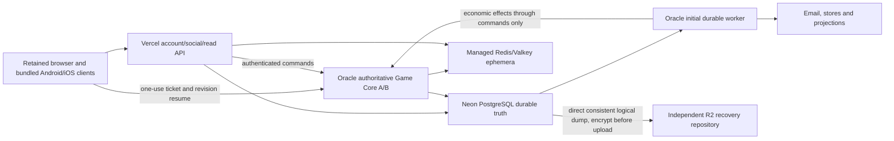

# V5 architecture and ownership ADR

Status: target architecture and source ownership frozen for extraction; not a claim these V5 services are deployed. Integration owner serializes schema, migration, identity, economics and contract changes. Normative source: supplied AGENT-GOAL.md, pack architecture/specifications and the final P00–P24 sequence. Current deployment evidence is separate in BASELINE.md.

## Authority and deployable boundaries

- `apps/api`: stateless account, social, practice archive, authorized reads, callbacks and retained-origin compatibility facade. Browser host-only cookies and CSRF remain distinct from native bearer transport; no broad shared-cookie-domain fiction.
- `apps/game-core`: sole competitive/economic mutation authority, accepted game/rank/queue/tournament rules, wallet/escrow/ledger, grants/purchases/refunds and durable match revisions/deadlines. Direct realtime and HTTP fallback invoke the same command transaction/outcome.
- `apps/worker`: durable jobs/outbox claims, external delivery/finalization, authorized privacy workflows, projections and scheduling. Economic/competitive effects call Core; no independent payout/grant writer.
- Native Kotlin/Swift hosts bundle allowlisted approved assets, secure host-owned credentials and lifecycle adapters. No new UI framework, website dependency, arbitrary credentialed fetch bridge or remotely replaced client bundle.
- `apps/web` is a dormant presentation boundary, not an empty application passed off as implementation. Domains/API/auth/callback/association resources and a private browser-style harness are in scope; new website/browser product P21 is owner-deferred.
- Incremental real packages: domain/economy/contracts/auth/db/redis/telemetry/testing only when they contain actual used implementation. Preserve the approved client/rules while migrating callers; no mass move, dead aliases or copied independent policy constants.

## Complete current-source ownership register

[ROUTE-AND-DATA-INVENTORY.md](ROUTE-AND-DATA-INVENTORY.md) enumerates mounted account/social/competitive/monetization/party/provider/static/private routes, standalone/test-only distinctions, all 35 SQLite tables, serialized account/match/room/practice/ad-cadence structures, all discovered writer families and constructor/startup hazards. [Raw snapshot schema evidence](evidence/phase00-source-schema.json) confirms 35 tables and eight serialized authority roots on an exact read-only restored snapshot without constructors or player-row output.

| Mutable domain | V5 write owner | Required cross-domain boundary |
|---|---|---|
| Actors, linked identities, credentials, session/refresh families, OTP/sign-in attempts | Account/API | Pending-ready actor -> idempotent Core initial-wallet provisioning; provider subjects never replace actor IDs |
| Profile/social/block graph, privacy-aware search, practice archives and preferences | Account/API | Friendship/block changes requiring offered-match cancellation delegate the economic/competitive effect to Core; practice wallet-shaped fields never restore assets |
| Wallets, reservations, ledger, burns, grants, purchases/entitlements/bindings/refund tombstones | Game Core | API allowlisted reads; worker verifies/delivers external work, then invokes idempotent Core effect |
| Match assignment/occupancy, accepted terms, state/revision/deadline, result/Elo/history/seasons/rewards | Game Core | Redis indices and worker wakes are not financial locks or independent settlement authority |
| Online rooms/tournaments, fixtures, escrow, refunds/payouts and timing | Game Core | One transaction spans room, actor/assets, settlement, operation outcome and outbox |
| Jobs/outbox leases/fences, provider finalization/notification delivery and projections | Worker | Producers insert transactionally within their own authority; worker completion requires current fence |
| Reports/privacy/deletion intake and policy-bound records | Account/API intake, authorized worker/operator workflow | Disable/admission and Core occupancy/economic-reference changes serialize; review signals remain review-only |
| Audit/security administration/support correlation/operational controls | Private authorized operator or issuing service restricted append | Dedicated audit key/chain continuity, allowlisted diagnostics; no public admin surface or wallet-grant operator |
| Presence/queue candidate indices/rate/cache/pubsub/socket handles | Disposable Redis/process ephemera | Permanent assignments/assets/results/security-critical revocation and one-use redemption survive Redis loss |
| Approved free local/LAN/offline practice and UI preferences | Client/local LAN scope | No second production economic or permanent-identity authority |

### Hidden effects that must not be mislabeled reads

Session bootstrap inserts anonymous sessions; search GET spends rate budget; profile/presence can clean queue offers; queue GET matches/expires; match GET may time out and settle; monetization status may create permanent store bindings; AdMob SSV is an economic GET; every production response may append sanitized support correlation. Ordinary party room GET is a view, not a tick. Authority read-time season normalization is initially in-memory but a later writer can persist it. Source inventory distinguishes these effects and which are projections, Core commands, durable identity facts or disposable budgets.

The serialized `state` row currently mixes owners. Account provisioning/profile/social/delete/operator, room/economy and monetization writers do not all pass through DurableStore.run. Extraction must eliminate API/worker unrestricted economic rewrites, not merely rename that dispatcher. Existing notification tombstone/refund/dedupe boundaries and finalize-before-delivery writes require explicit atomic/idempotent redesign without changing product effects.

## Persistence, transaction and concurrency decisions

1. After cutover PostgreSQL is sole durable authority. Normalize contention/authority records (actors/wallets/occupancy/commands/settlements/identity/jobs); bounded immutable or revisioned board/room snapshots may be JSONB. Do not retain one hot global economy JSONB or permanent SQLite dual writes.
2. Existing actor IDs/tags/provider subjects/store bindings remain exact text identities, not assumed UUIDs or email merges. Integer currency/reservations preserve safe-integer API semantics; Elo preserves hundredths. Retain purchases/refund tombstones, histories, relationships, privacy/deletion/audit state.
3. Every business command uses one shared unit of work. Lock the business aggregate first, then occupancy/actor rows in sorted actor order, then wallet/asset rows in the same order, then dependent ledger/outcome/outbox rows. Final SQL/repository implementations must enforce/document that order and exercise contention; repository methods must not independently commit.
4. Look up operation outcome before stale-revision rejection. A stable actor/domain/key and canonical payload fingerprint returns the prior committed result or rejects key reuse with changed payload. Persist mutation, result/idempotency and outbox atomically; uncertain acknowledgment is resolved by operation identity, never a new key.
5. External provider/email/network I/O occurs outside monetary transactions. At-least-once jobs/events need idempotent effects, unique business identities, claims/fences and bounded delivery. A stale lease cannot finish after a newer worker has advanced the job/room.
6. Committed moves and absolute accepted deadlines survive process death; reconnect can land on another Core. Never use V4 startup void/refund as process recovery, reset clocks on reconnect or treat process restart as host leave.
7. Runtime roles are distinct and cannot perform DDL. API cannot update wallets/settle; worker cannot payout; Core cannot export all credentials; migration owner is privileged only in trusted operator/CI execution; backup reader cannot mutate. Role-denial tests are required, not merely role names.
8. Migrations are checked-in/checksummed/serialized using direct TLS-verified connections. Bounded Core/worker pools and Vercel pooled connections share an explicit actual-compute budget; no session-lock assumptions on transaction pooling. Production/nonproduction projects, credentials, audiences and outbound provider modes are isolated.

## Migration, release and recovery boundaries

Parse raw SQLite relational/serialized state from consistent snapshots without Authority/store constructors, addAccount/default grants or current-time season rollover. Source field/table coverage, deterministic reruns/interrupted batches and per-actor/asset/relationship/reservation reconciliation must prove zero unexplained differences; global totals alone are insufficient. Raw records stay encrypted/access-controlled outside Git/public CI. Unknown historical fields fail coverage review rather than disappearing.

Use expand/backfill/compatible deploy/switch/later contract. Release independent exact tested immutable Core/worker digests and exact Vercel deployments with schema/protocol/config compatibility; native signing/distribution is a separate trusted path. V4.1 remains live until gated P22. The first post-import production application write—including auth, background or webhook effects—is the rollback boundary. After it, preserve PostgreSQL authority and forward-fix or deploy a tested PostgreSQL-compatible prior build; never restore an old SQLite writer silently.

Current Oracle Caddy remains the sole 80/443 owner. New isolated V5 staging must use nonconflicting private roots/networks/ports and validated shared-edge routing without stopping V4 or co-hosted services. Core A/B on that host provide process failover only; host/edge loss remains a separate measured capacity decision. Preserve strict non-root/read-only/capability/resource/private-operator controls, dedicated audit HMAC and monitoring.

Neon history/PITR and direct encrypted logical R2 backups are independent recovery paths; prove restore into an isolated PostgreSQL target with all invariants and privacy/revocation quarantine. Existing successful V4 Restic recovery resolves the historical backup conflict but is not V5 PostgreSQL restore proof. Never initialize over an existing encrypted repository or hide backup staleness by redefining ops health.

## Scope, failure and acceptance

Keep four approved themes/layout/assets, all game/economy/season/rank/matchmaking/tournament/ad-placement policy and bought/earned Crown utility unchanged. Frames stay archived; review-only abuse signals never auto-punish. Unavoidable native SDK/system/safe-area adaptations are minimal individually evidenced exceptions.

- PostgreSQL unavailable: no authoritative mutation/grant and no SQLite fallback writer.
- Core unavailable: independent authorized reads/offline modes remain available; competitive mutation fails safely.
- Redis unavailable/lost: no permanent asset/result/identity loss; bounded queue/presence/cache degradation and revision/snapshot recovery.
- Worker unavailable: jobs remain durable and backlog alerts; no lost provider grant/finalization/deletion work.
- Vercel unavailable: existing valid realtime/offline can continue within explicit credential policy; new login/tickets may fail.

P00–P03 foundation gates precede dependent distributed work. Early V5 CI is already enabled and the first checkpoint actually validated. P20 native artifacts/device/provider acceptance precedes P22; P21 deferral is not a failed dependency. P24 records measured limits/triggers and adds capacity only when justified. Implementation/local/staging/device/upload/submission/provider-approval/production states remain separate; no code-only or fixture-only completion claims.
